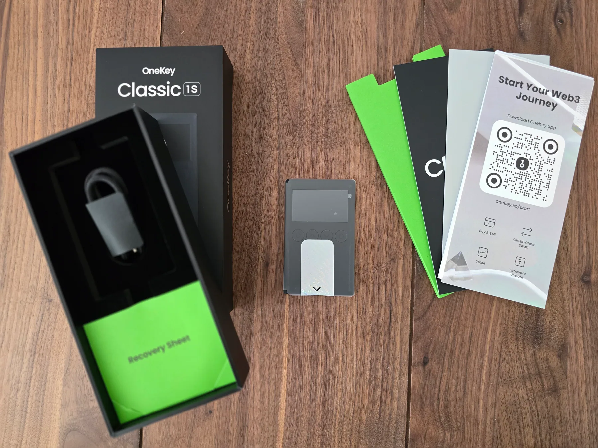
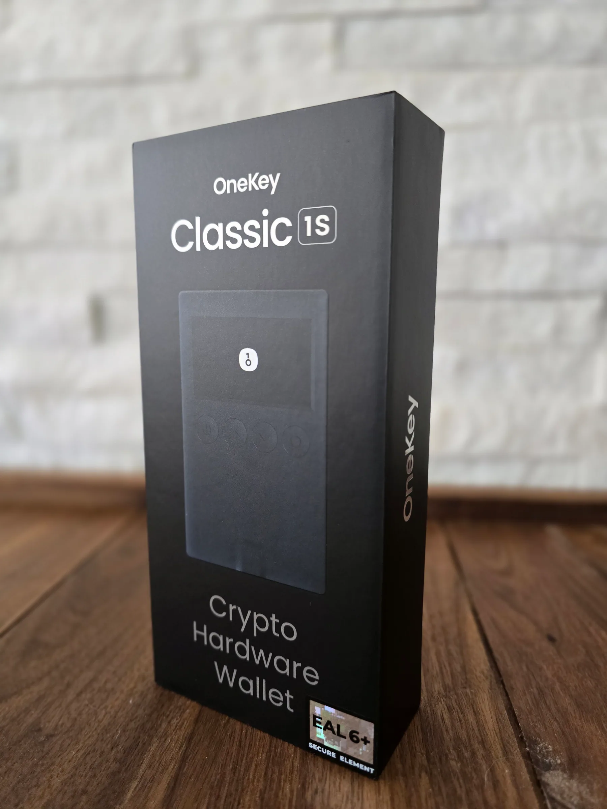
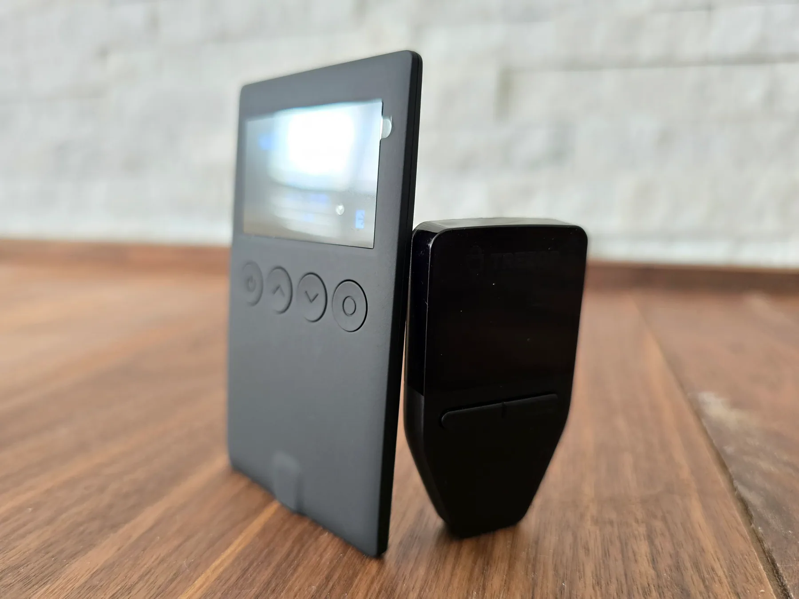
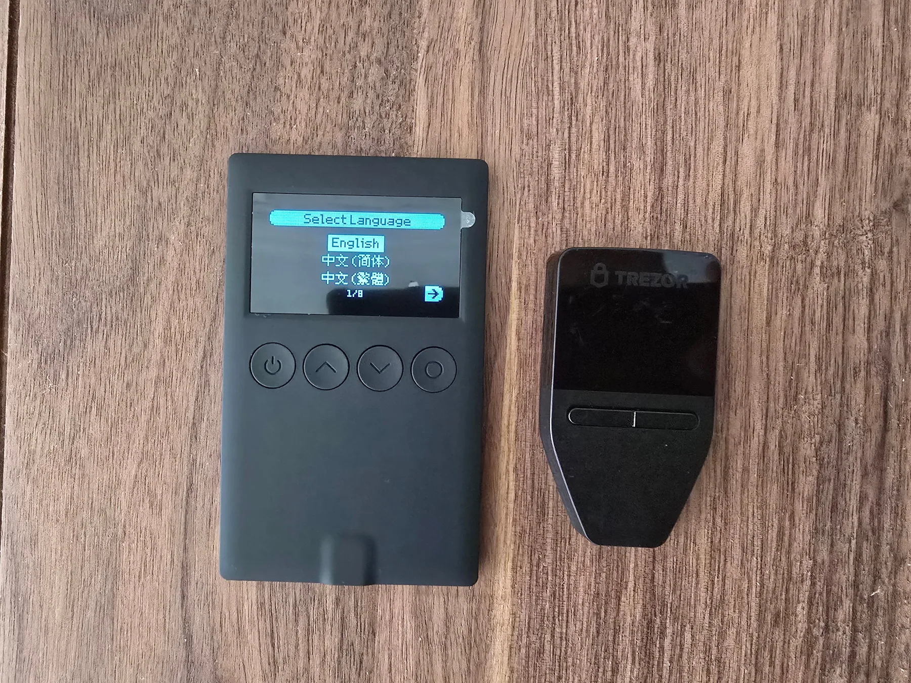
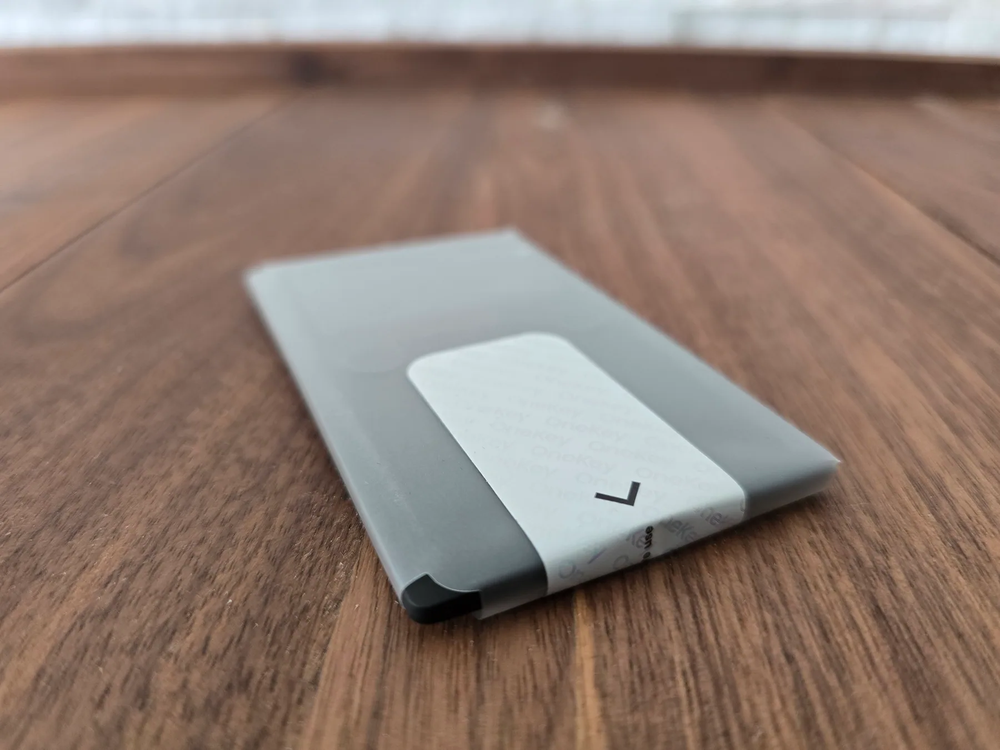
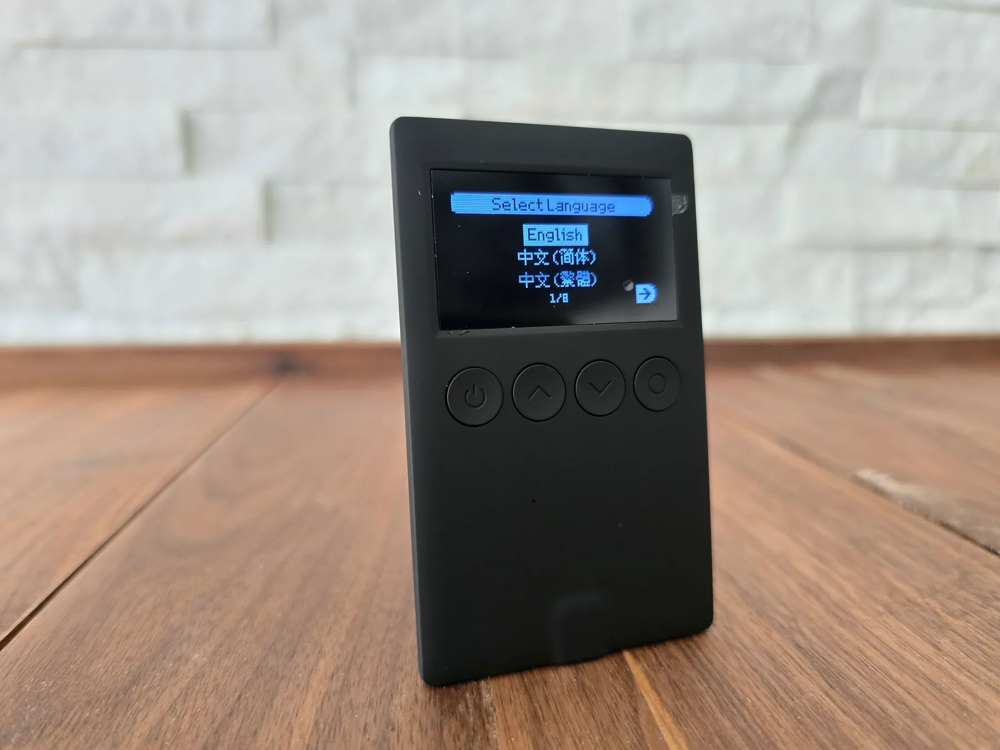
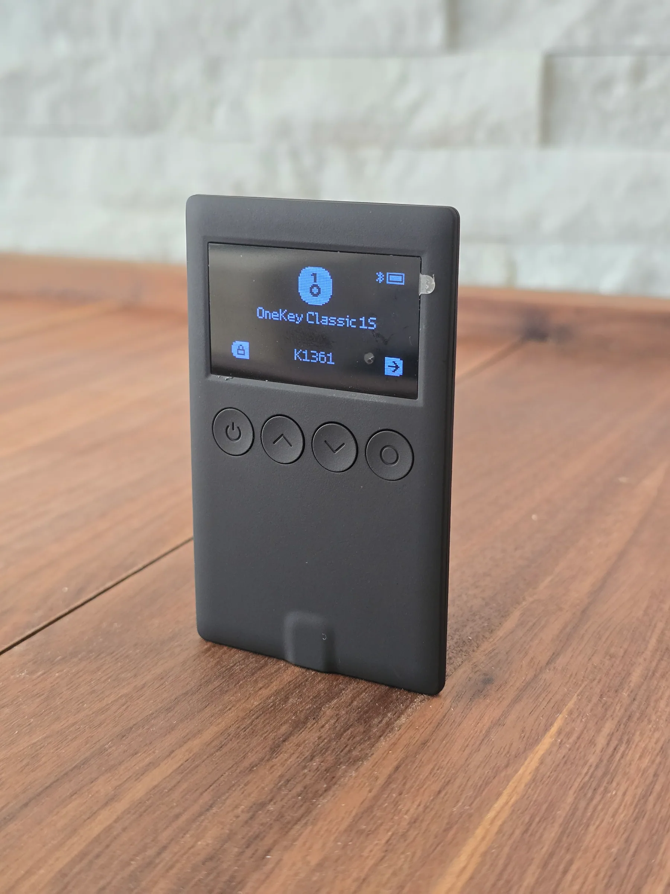

**Disclosure:** OneKey sent me a free Classic 1S review unit for an honest opinion. If you decide OneKey is the right fit, using my referral link — [onekey.so/r/KAHTAF](https://onekey.so/r/KAHTAF) — should apply a 10% discount and may earn me a commission.

**TL;DR:** Trezor Safe 3 is the better conservative custody wallet. OneKey Classic 1S is the better active crypto wallet. Both are affordable hardware wallets with secure-element protection, physical confirmation, open-source claims, and small screens. The difference is workflow: Trezor is USB-powered, desktop-first, backup-focused, and built around long-term self-custody. OneKey is slimmer, Bluetooth-capable, app-centered, and better suited to users who regularly move across chains, apps, swaps, NFTs, or DeFi. If iPhone use is central to your wallet workflow, Trezor Safe 3's iOS limitations matter.

This comparison focuses on buying fit, not a universal winner. If the wallet mostly protects long-term holdings, Trezor Safe 3 is easier to recommend. If the wallet needs to pair with a phone, support a broader app workflow, and reduce mistakes while signing active Web3 transactions, OneKey Classic 1S has the stronger case. The sourcing here is intentionally limited to official product pages and help docs, so check the current official compatibility pages for your exact assets and chains before buying.

## Quick comparison

OneKey lists an [EAL6+ secure element](https://onekey.so/products/onekey-classic-1s/), Bluetooth, USB-C, 30,000+ coins, clear signing preview, SignGuard, open-source firmware/apps, reproducible builds, tamper-evident packaging, firmware authenticity checks, and a $99 Classic 1S / $79 Classic 1S Pure split. Trezor lists [Secure Element protection](https://trezor.io/trezor-safe-3), open-source design, on-device confirmation, PIN/passphrase protection, Trezor Suite, thousands of supported coins and tokens, USB-C, a two-button pad, and a 0.96-inch monochrome OLED.

| Feature | OneKey Classic 1S | Trezor Safe 3 |
| --- | --- | --- |
| Best fit | Active crypto users, mobile users, multi-chain users | Conservative self-custody, desktop users, long-term holders |
| Price in official pages | [$99 Classic 1S; $79 Classic 1S Pure / BTC-only Pure](https://onekey.so/products/onekey-classic-1s/) | [$59 listed offer price](https://trezor.io/trezor-safe-3) in Trezor product metadata |
| Security hardware | [EAL6+ secure element](https://onekey.so/products/onekey-classic-1s/) | [EAL6+ OPTIGA Trust M (V3)](https://trezor.io/learn/security-privacy/how-trezor-keeps-you-safe/secure-elements-in-trezor-safe-devices) secure element |
| Connectivity | [USB-C and Bluetooth](https://onekey.so/products/onekey-classic-1s/) | USB-C; [no battery](https://trezor.io/guides/trezor-devices/trezor-safe-3/trezor-safe-3-faqs) |
| App workflow | [OneKey App](https://onekey.so/mobile-app/), swaps, staking, perps, risk detection, hardware pairing | [Trezor Suite](https://trezor.io/trezor-suite) for send, receive, buy, sell, swap, stake, portfolio, privacy tools |
| Signing focus | [Clear Signing + SignGuard](https://help.onekey.so/en/articles/12058229-signguard-and-clear-signing-how-they-protect-you-from-web3-phishing-and-scams) risk alerts | On-device confirmation with Trezor Suite and supported third-party apps |
| Backup story | Recovery phrase, [passphrase and hidden wallets](https://help.onekey.so/en/articles/11461220-passphrases-and-hidden-wallets) | [SLIP39 single/multi-share backups](https://trezor.io/guides/trezor-devices/trezor-safe-3/trezor-safe-3-faqs) plus BIP39 12/18/24-word recovery |
| Main trade-off | More app surface, Bluetooth, and more active-use complexity | Less mobile flexibility; USB-powered desktop ritual |

## Security

Trezor has the cleaner conservative security story. Trezor says Safe 3 uses the [OPTIGA Trust M (V3)](https://trezor.io/learn/security-privacy/how-trezor-keeps-you-safe/secure-elements-in-trezor-safe-devices) secure element to strengthen protection against physical attacks. The chip helps enforce PIN protection, verify device authenticity, and contribute entropy during wallet creation. After 16 incorrect PIN attempts, it erases a secret and the device resets; the wallet can be recovered from the backup.

That explanation is concrete. It does not imply the secure element solves every risk. It explains the chip's job and makes the backup model central.

OneKey's security story is also serious, but it is framed more around active signing. OneKey says Classic 1S keeps keys offline, uses [EAL6+ secure chips](https://onekey.so/products/onekey-classic-1s/), supports open-source firmware/apps with reproducible builds, and includes tamper-evident packaging plus firmware authenticity checks during activation. Its [authentication guide](https://help.onekey.so/en/articles/11461091-authenticate-onekey-classic-1s) also tells buyers to inspect the package, confirm the holographic seal, make sure recovery cards are blank, and generate recovery phrases only on the device screen.

The more distinctive OneKey feature is [SignGuard plus Clear Signing](https://help.onekey.so/en/articles/12058229-signguard-and-clear-signing-how-they-protect-you-from-web3-phishing-and-scams). OneKey says Clear Signing makes transaction data human-readable, while SignGuard provides real-time risk detection for malicious contracts, suspicious approvals, phishing sites, and abnormal behavior before signing. That matters because a hardware wallet does not protect users from approving a transaction they do not understand. OneKey is trying to make the approval itself safer, though risk alerts reduce blind signing rather than guarantee safety.

So the security split is not just chip versus chip. Trezor is optimized for custody discipline: simple device, strong recovery model, deliberate signing. OneKey is optimized for active signing: more app connectivity, more transaction types, and more help understanding what is being approved.

## Trust and open source

Both companies lean on transparency. OneKey says its firmware and apps are [open source with reproducible builds](https://onekey.so/products/onekey-classic-1s/), independent GitHub verification, and third-party security audits. Trezor puts [open-source design](https://trezor.io/trezor-safe-3) on the Safe 3 product page and says it chose a secure element path that does not require NDAs or compromise its open-source philosophy.

Trezor has the trust advantage because of history. Hardware wallets are trust products: the buyer is trusting not only the device, but also the company's updates, docs, supply chain, and incident response. OneKey's open-source and audit claims are meaningful, but Trezor's longer public track record still makes it the easier conservative choice.

## Hardware and portability

OneKey wins portability and connectivity. The [Classic 1S line](https://onekey.so/products/onekey-classic-1s/) is built around a slim form factor, USB-C, Bluetooth, and a choice between a battery model and a battery-free Pure model. That gives buyers a useful fork: choose the standard Classic 1S for mobile convenience, or choose the Pure if battery-free storage matters more. Bluetooth is the same kind of trade-off: useful if mobile use matters, unnecessary if you prefer fewer wireless components.

Trezor Safe 3 is also small: [59 x 32 x 7.4 mm and 14 g](https://trezor.io/trezor-safe-3), with a two-button pad, 0.96-inch monochrome OLED, and USB-C. But it is not trying to be a Bluetooth mobile wallet. Trezor's FAQ says Safe 3 has [no battery](https://trezor.io/guides/trezor-devices/trezor-safe-3/trezor-safe-3-faqs) and only turns on when plugged into a computer.

That is a real advantage for long-term storage. No battery means no charging habit, no battery aging concern, and one fewer component to worry about. It also makes the device less flexible. Trezor feels like a wallet for deliberate sessions. OneKey feels like a wallet for people who expect to carry and use it more often.

## App workflow

OneKey has the broader app workflow. The [OneKey App](https://onekey.so/mobile-app/) official page presents a full multi-chain wallet: buy, sell, send, receive, swap, stake, market tracking, app lock, malicious dApp blocking, transaction preview, similar-address detection, hardware connection verification, 30,000+ coins, multi-network dApp connectivity, perps, and cold-wallet pairing.

That breadth is the point of OneKey Classic 1S. It is not just a seed-storage device with a companion app. It is meant to be part of a larger active crypto workflow.

Trezor Suite is narrower, but polished around custody. Trezor describes [Trezor Suite](https://trezor.io/trezor-suite) as the official app for managing a Trezor wallet: send, receive, buy, sell, swap, stake, track crypto, use coin control, connect through Tor, and use supported third-party wallet apps when needed. Safe 3 also supports third-party wallet apps, but Trezor's product page notes an [iOS limitation](https://trezor.io/trezor-safe-3): no swap, send, setup, or device management on iOS.

For a buyer, the question is whether breadth is useful or distracting. OneKey's app gives active users more to do. Trezor's app gives long-term holders fewer moving parts.

## Coins, chains, and DeFi

OneKey's official positioning is stronger for multi-chain activity. The Classic 1S product page and OneKey App page both claim support for [30,000+ coins](https://onekey.so/mobile-app/). The app page also emphasizes multi-network dApp connectivity, swaps, staking, perps, risk detection, and hardware-wallet pairing.

Trezor also supports a broad set of assets. Safe 3 supports thousands of coins and tokens, and Trezor's [supported coins](https://trezor.io/coins) page lists major assets such as Bitcoin, Ethereum, USDT, BNB, USDC, XRP, Solana, TRON, Dogecoin, Cardano, and more, with support varying by model and wallet app.

The difference is emphasis. Trezor can handle a lot of assets. OneKey is more explicitly designed around a multi-chain app experience. If the buyer mostly holds BTC, ETH, or major assets, Trezor is enough. If the buyer expects to use swaps, dApps, perps, and phone-based workflows often, OneKey is the more natural fit. Either way, asset count is less useful than checking whether the exact network, token, and app workflow you plan to use is supported.

## Backups and recovery

Trezor wins the backup category. Safe 3 supports [SLIP39 wallet backups](https://trezor.io/guides/trezor-devices/trezor-safe-3/trezor-safe-3-faqs), including single-share and multi-share backups, and can recover existing BIP39 backups with 12, 18, or 24 words. Trezor's product page also makes backup options a major part of the Safe 3 pitch.

OneKey covers the standard self-custody basics. Its authentication guide says recovery phrases are the only way to recover assets, must be generated on the device screen, and should never be stored digitally. OneKey also supports [passphrases and hidden wallets](https://help.onekey.so/en/articles/11461220-passphrases-and-hidden-wallets); its help page explains that a passphrase creates a separate wallet and warns that losing the passphrase means losing access to that hidden wallet.

Both are viable. Trezor's backup story is simply more differentiated. If a buyer is designing a long-term recovery plan for serious holdings, Safe 3 has the edge. For either wallet, buy through the official store or authorized resellers, inspect the packaging, and initialize the recovery phrase yourself on the device.

## Weak spots

OneKey's weakness is complexity. The app surface is broad: swaps, staking, perps, dApp connectivity, risk detection, hidden wallets, and hardware pairing. That is useful for active users, but it creates more decisions. The buyer needs to be comfortable reading prompts, managing approvals, and understanding when an app feature adds convenience versus risk.

Trezor's weakness is flexibility. Safe 3 is USB-powered, has no battery, uses a two-button interface, and has iOS limits for swap, send, setup, and device management. That makes it a calmer custody device, but a less convenient daily crypto device.

## Recommendation

Choose **Trezor Safe 3** if the goal is conservative self-custody: long-term holdings, desktop sessions, mature open-source trust, no battery, and stronger backup options. It is the cleaner pick for someone who wants a hardware wallet to be boring, deliberate, and easy to reason about.

Choose **OneKey Classic 1S** if the wallet needs to fit active crypto habits: phone use, Bluetooth, multi-chain assets, swaps, staking, dApps, perps, risk alerts, and clearer signing previews. It is the better fit for someone who expects the hardware wallet to participate in daily Web3 workflows rather than sit in a drawer.

The simplest version: **Trezor Safe 3 is the better boring wallet. OneKey Classic 1S is the better active wallet.**

That is not a knock on either product. For self-custody, boring can be a feature. For active crypto, convenience and transaction clarity can also be security features. The right choice depends on which risk is bigger: losing access years from now, or approving the wrong thing while using crypto today.
